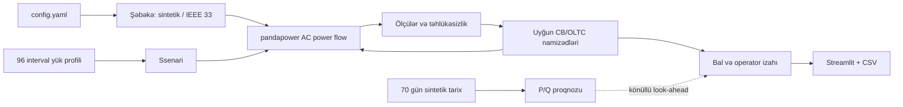

# Arxitektura

- `network.py`: 35/10 kV feeder və paketdəki Baran-Wu `case33bw()` qurulur. IEEE şəbəkəsinə ayrıca upstream 35 kV transformer/OLTC və üç şunt əlavə olunur.
- `power.py`: yalnız həqiqi AC nəticələri KPI verir; uğursuz həll `PowerFlowError` qaytarır.
- `profiles.py`: seeded 15 dəqiqəlik yük faktorları və proqnoz üçün ayrıca sintetik tarix.
- `control.py`: state, dwell, limit, lokal baseline, namizəd enumerasiyası, təhlükəsizlik və bal.
- `experiment.py`: hər controller müstəqil şəbəkə/state ilə eyni profilə baxır.
- `forecast.py`: zaman üzrə ayrılmış persistence/ML test. Proqnoz cihaz vəziyyətini birbaşa təyin etmir.
- `app.py`: yalnız decision support, hesablanmış nəticələr, tarixçə və ixrac.

Şəbəkə topologiyası səhv olarsa qərar etibarlı deyil; gələcək SCADA inteqrasiyasında topologiya və ölçü keyfiyyəti əvvəlcə yoxlanmalıdır.
